<div align="center">

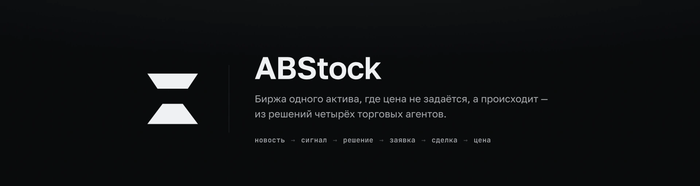

<br>


</div>

---

Обычный биржевой симулятор рисует цену по формуле и показывает её графиком. ABStock устроен наоборот: **цены как отдельной сущности здесь нет.** Есть четыре автономных агента, есть стакан заявок, и цена — это просто цена последней сделки, которую они друг о друга исполнили.

Отсюда всё остальное. Оператор создаёт актив описанием на человеческом языке, запускает торги и вводит новости — а интерфейс обязан показать не только результат, но и **причину**: почему конкретный агент купил именно сейчас и как введённый текст добрался до цифры на графике.

<div align="center">
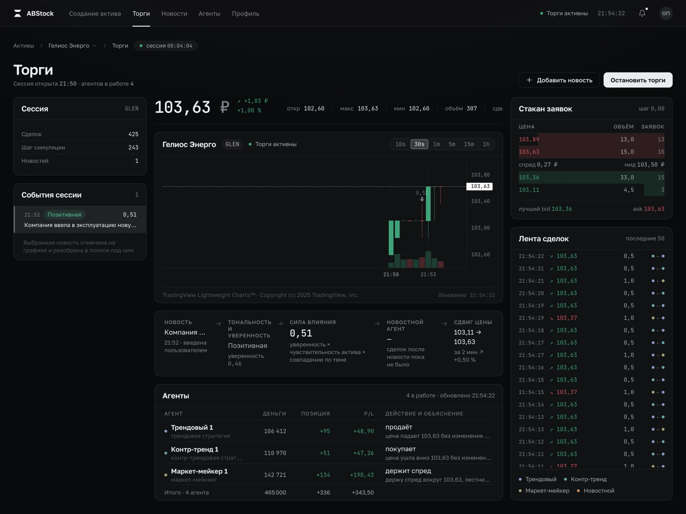
</div>

---

## Путь новости в цену

Ключевое требование продукта: **любое решение агента должно быть объяснимо.** Поэтому у каждого действия в интерфейсе есть место под причину, а не только под результат.

<div align="center">
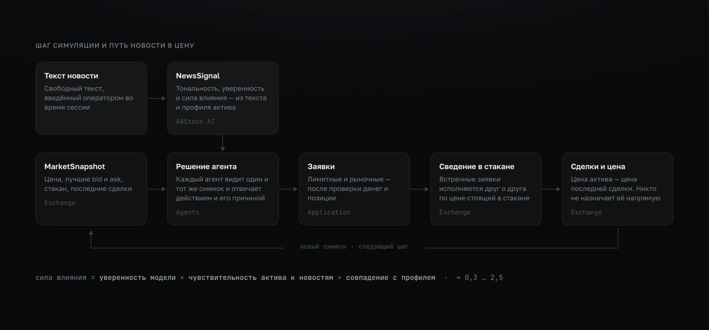
</div>

Текст новости не превращается в цену магически. Полоса связи разбирает превращение на шесть шагов и показывает их одной строкой — слева направо, как одну фразу:

<div align="center">
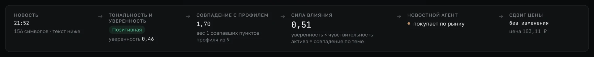
</div>

Сила влияния — не выдуманное число, а произведение трёх множителей:

```
ImpactScore = Confidence × NewsSensitivity × AspectMatchScore
              ↑            ↑                 ↑
              уверенность  чувствительность  насколько новость
              модели       актива к новостям задела пункты профиля
```

`AspectMatchScore` считается по настоящему тексту: слова новости сравниваются с формулировками профиля по общему началу — русский флективный, и «сетей» против «сети» иначе не свести. Правило нарочно грубое, но честное. Когда на его место придёт языковая модель, поменяется реализация `IAspectMatcher`, а не форма результата.

---

## Четыре агента

Каждый агент видит один и тот же снимок рынка и отвечает решением **и его причиной**. Причина — не украшение: она едет в таблицу на «Торгах», в карточку агента и в ленту событий.

| Агент | Что делает | Причина, которую он произносит |
|---|---|---|
| **Трендовый** | Идёт за движением: цена вверх — покупает, вниз — выходит | «цена растёт 103,11 → 103,37 — иду за движением» |
| **Контр-тренд** | Торгует откаты: покупает просадку, продаёт рост | «цена ушла вниз 103,37 → 103,11 — покупаю просадку» |
| **Маркет-мейкер** | Держит лестницу заявок на 4 уровня по обе стороны | «держу спред вокруг 103,11, лестница на 4 уровня» |
| **Новостной** | Молчит до первой новости, дальше бьёт по рынку | «новостей в сессии не было — сигнала нет, заявки не выставляются» |

Состав задаётся не в коде, а перед запуском — количество экземпляров каждого типа и капитал одного экземпляра:

<div align="center">
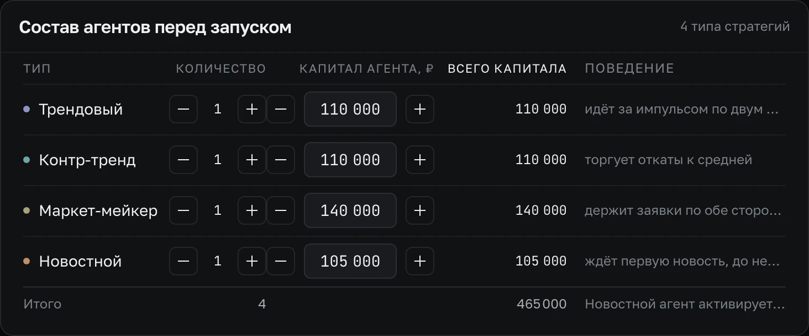
</div>

---

## Экраны

<table>
<tr>
<td width="50%">

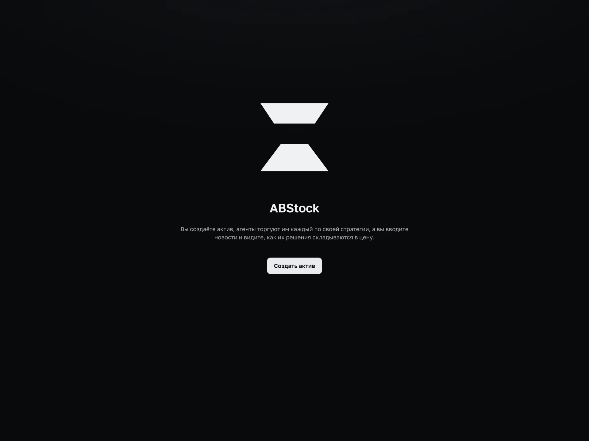

**Приветственная**<br>
Имя продукта, знак и одно действие. Ни поддельного графика, ни бегущей строки: выдуманные числа на первом экране обесценивают настоящие на всех следующих.

</td>
<td width="50%">

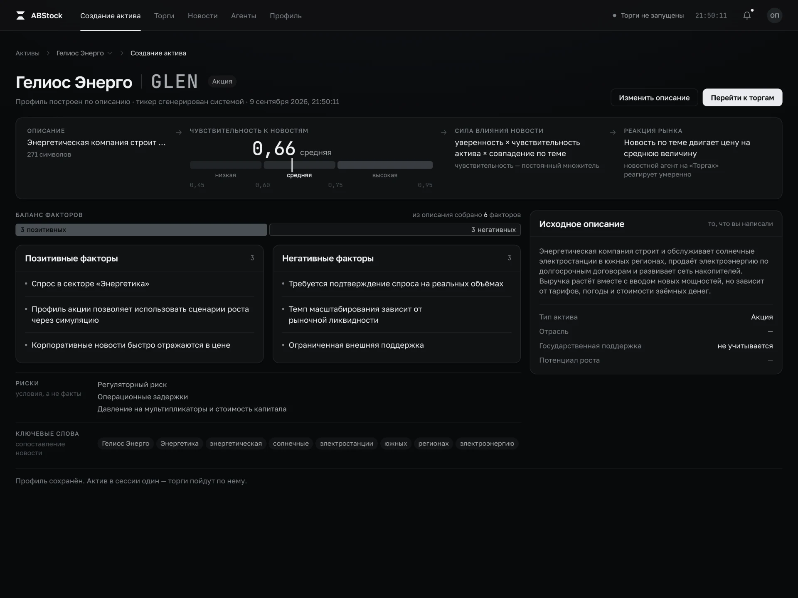

**Создание актива**<br>
Свободное описание превращается в профиль: чувствительность к новостям, позитивные и негативные факторы, риски, ключевые слова. Тикер система придумывает сама.

</td>
</tr>
<tr>
<td width="50%">

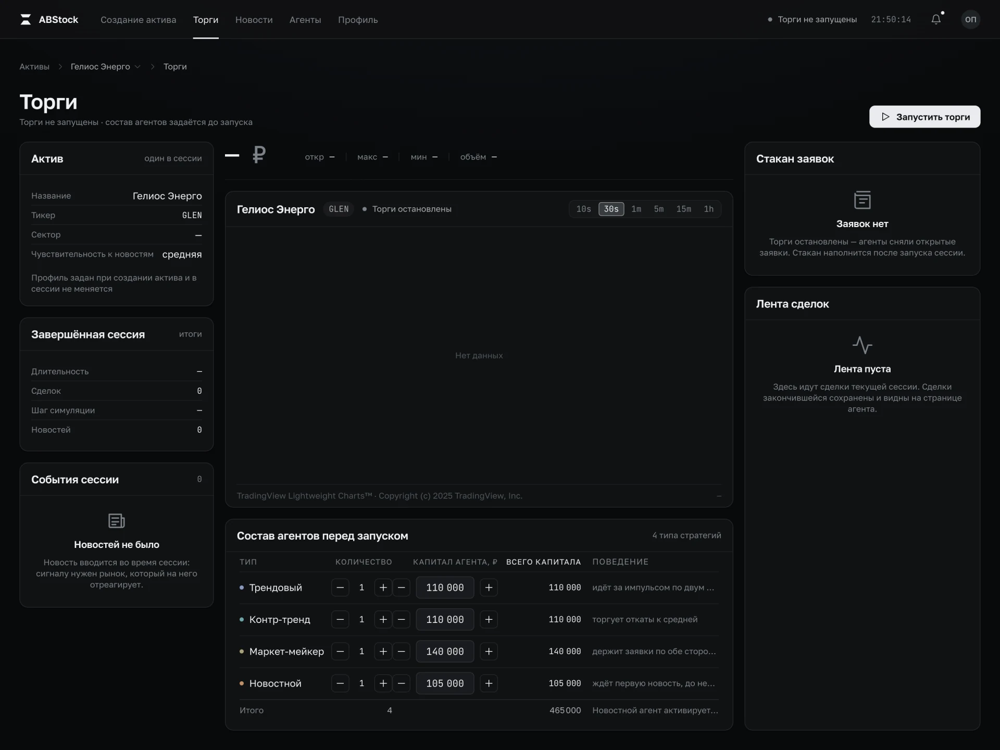

**Торги до запуска**<br>
Пустые состояния честные: стакан объясняет, что заявок нет, потому что агенты их сняли, а не потому что «нет данных».

</td>
<td width="50%">

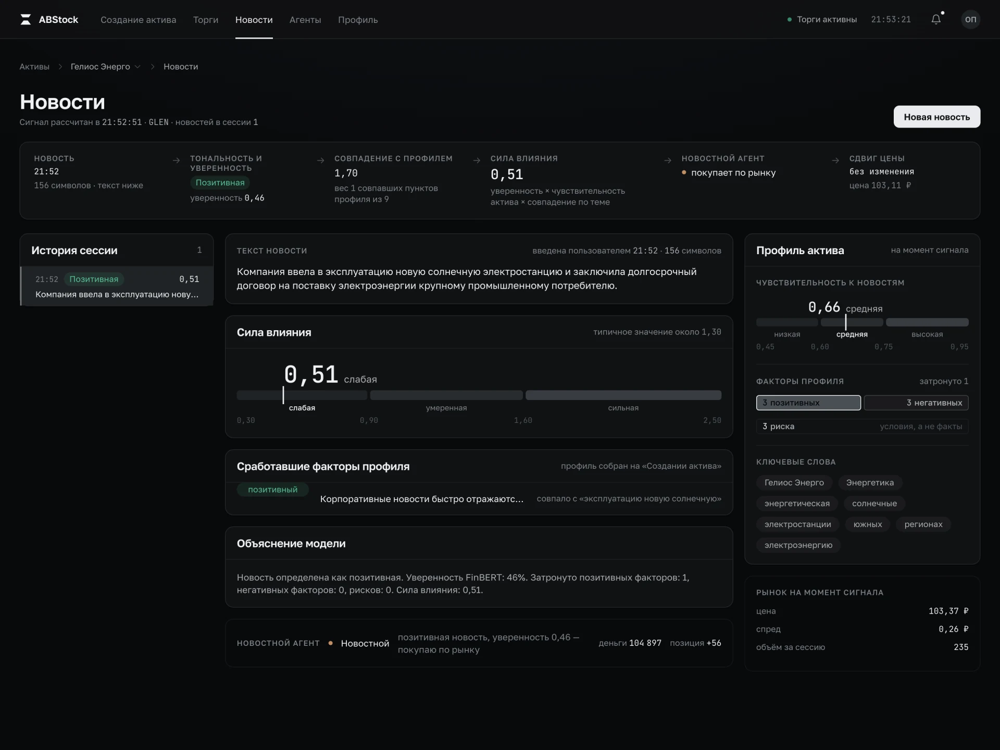

**Новости**<br>
Текст, шкала силы влияния с размеченными зонами, сработавшие факторы профиля с фрагментом совпадения и объяснение модели простым языком.

</td>
</tr>
<tr>
<td width="50%">

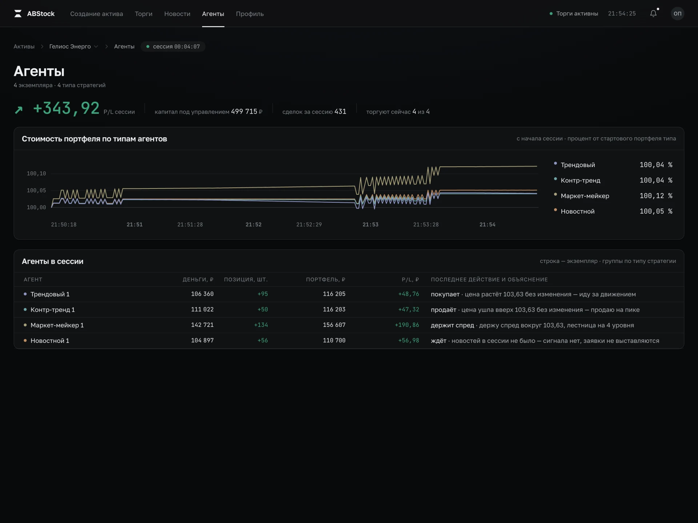

**Агенты**<br>
Стоимость портфеля по типам стратегий с начала сессии — в процентах от стартового портфеля своего типа, чтобы линии сравнивались между собой.

</td>
<td width="50%">

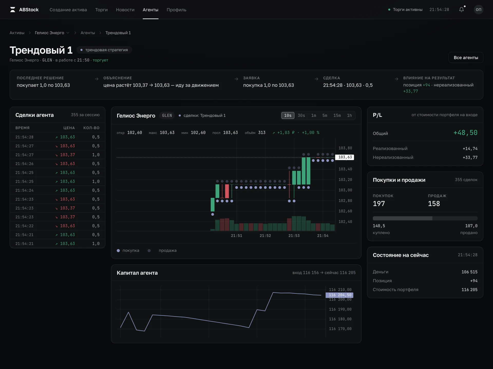

**Детальная агента**<br>
Все сделки экземпляра, его метки на общем графике, реализованный и нереализованный P/L, кривая капитала.

</td>
</tr>
</table>

---

## Детали

<table>
<tr>
<td width="34%">

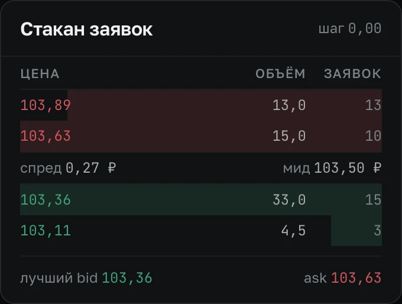

**Стакан**<br>
Глубина — заливкой, а не отдельной колонкой. Спред и мид разделяют стороны.

</td>
<td width="66%">

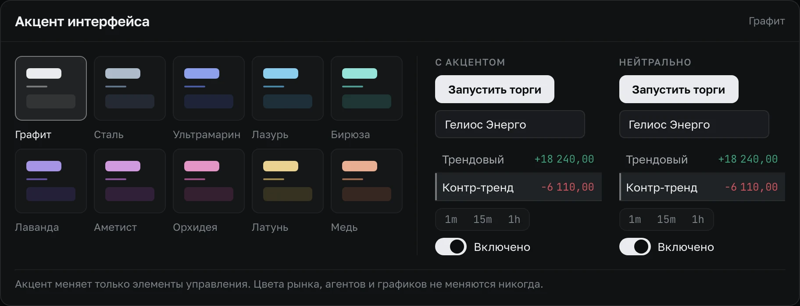

**Акцент интерфейса**<br>
Десять пресетов, каждый — ровно шесть токенов. Акцент красит только элементы управления. Цвета рынка, агентов и графиков не меняются никогда: пользователь, сменивший акцент, не должен увидеть, что рынок стал другого цвета. Справа — живой предпросмотр: настоящие элементы кита рядом с нейтральными.

</td>
</tr>
</table>

---

## Архитектура

<div align="center">
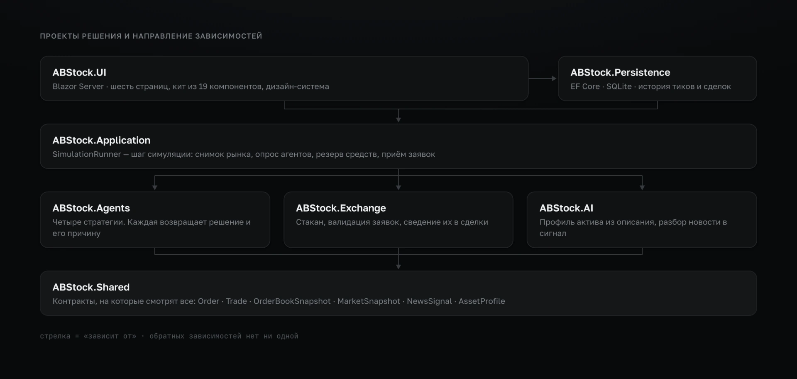
</div>

Четыре правила, которые держат всю схему:

- **Exchange не знает о новостях.** Он сводит заявки — и всё.
- **Agents не меняют цену напрямую.** Агент возвращает решение; цену двигает только исполненная сделка.
- **AI не создаёт заявок.** Он отдаёт `NewsSignal`, а решает по нему агент.
- **UI без бизнес-логики.** Страница показывает то, что ей дали, и не считает рынок сама.

Симуляция, актив сессии, лента новостей и история портфеля живут синглтонами: прогон один на сервер, и он переживает перезагрузку страницы, переход по прямому адресу и открытие второй вкладки. Настройки интерфейса, наоборот, scoped — их источник истины в `localStorage` браузера.

---

## Запуск

```bash
dotnet run --project src/ABStock.UI
```

Порты задаёт `src/ABStock.UI/Properties/launchSettings.json`. База — SQLite, создаётся рядом файлом `abstock.db`; строку подключения можно переопределить:

```bash
ConnectionStrings__ABStock="Data Source=/tmp/abstock.db" dotnet run --project src/ABStock.UI
```

Сценарий первого запуска: **создать актив** описанием → **Торги** → задать состав агентов → **Запустить торги** → через минуту-другую зайти в **Новости** и ввести любой текст про эту компанию.

---

## Тесты

```bash
dotnet test
```

209 тестов, все зелёные:

| Проект | Тестов | Что проверяет |
|---|--:|---|
| `Exchange.Tests` | 48 | Стакан, приоритет заявок, сведение, валидация, отображение глубины |
| `UI.Tests` | 100 | Сессия, роспись агентов, лента уведомлений, настройки, привязка параметров Razor |
| `AI.Tests` | 28 | Ключевые слова профиля, чувствительность, сопоставление новости с профилем |
| `Agents.Tests` | 21 | Поведение стратегий и формулировки их причин |
| `Application.Tests` | 11 | Шаг симуляции, резервирование средств, дублирование имён |
| `Persistence.Tests` | 1 | Запись и чтение истории рынка |

Отдельно от них живёт базовая линия интерфейса — инструмент на Playwright вне решения: дамп вычисленных стилей 108 опорных элементов на 7 маршрутах × 3 ширинах × 4 состояниях. Приложение живое, два PNG одного экрана не совпадут попиксельно никогда, поэтому доказывает не картинка, а дамп: он воспроизводим побайтно, и молчание сверки означает, что правка не сдвинула каркас. Снимки экранов в этом файле сняты им же.

---

## Структура репозитория

```
src/
  ABStock.Shared         контракты: Order, Trade, MarketSnapshot, NewsSignal, AssetProfile
  ABStock.Exchange       стакан, валидатор, сведение заявок
  ABStock.Agents         четыре стратегии на общей базе AgentBase
  ABStock.AI             профиль актива из описания, разбор новости в сигнал
  ABStock.Application    SimulationRunner — шаг симуляции и оркестрация
  ABStock.Persistence    EF Core · SQLite · история тиков и сделок
  ABStock.UI             Blazor Server: страницы, кит из 19 компонентов, дизайн-система
tests/                   шесть тестовых проектов, по одному на слой
assets/                  снимки экранов и схемы для этого файла
```

---

## Дизайн-система

Один файл — `src/ABStock.UI/wwwroot/design-system.css` — единственный источник значений. Ни макет, ни `.razor.css` не объявляет своего hex, радиуса или длительности.

**Пять принципов:**

1. **Данные — герой.** Число крупнее и контрастнее своего лейбла.
2. **Инструмент, а не витрина.** Плотный рабочий экран, а не презентация о продукте.
3. **Причинность видна.** Новость → сигнал → решение → заявка → сделка → цена читается с экрана без пояснений.
4. **Движение = смысл.** Анимируется только то, что произошло.
5. **Иерархия вместо декора.** Внимание распределяется размером, весом и пустотой — не цветом и свечением.

**Цвет несёт смысл, а не настроение.** Пропорция экрана: ~95 % графит и текст, ~4 % рынок, ~1 % акцент. Приглушённый нефрит и терракота достаются только рыночным величинам — цене, дельтам, P/L, стороне заявки, свечам, глубине стакана. Кнопки и статусы формы ими не красятся никогда.

**Числа набраны моно.** `JetBrains Mono` с `tabular-nums` на всём, что способно измениться: цена не прыгает при тике. Текст — `Golos Text`, гротеск, спроектированный под кириллицу.

Запрещены: размытые цветные пятна на фоне, неон на чёрном, свечения, градиентные заливки, ковёр из одинаковых карточек, эмодзи, стекло на панелях страницы. Стекло — материал только плавающих слоёв, под которыми реально проезжает контент.

---

## Работа в команде

Ветки: `main` · `dev` · `feature/*`. В `main` не пушат — только Pull Request с ревью. Коммиты — `feat` / `fix` / `refactor` / `chore` с областью в скобках.

В описании PR: **что сделано**, **как проверить**, **риски**.

Правки интерфейса проверяются всеми четырьмя состояниями базовой линии (`empty`, `asset`, `running`, `stopped`), а не подмножеством: часть разметки живёт ровно в одном из них, и проверка «по-быстрому» уже однажды пропустила падение контура на остановке торгов.

---

<div align="center">
<sub>Учебный проект. Один актив, четыре агента, одна сессия — и ни одной нарисованной цены.</sub>
</div>
